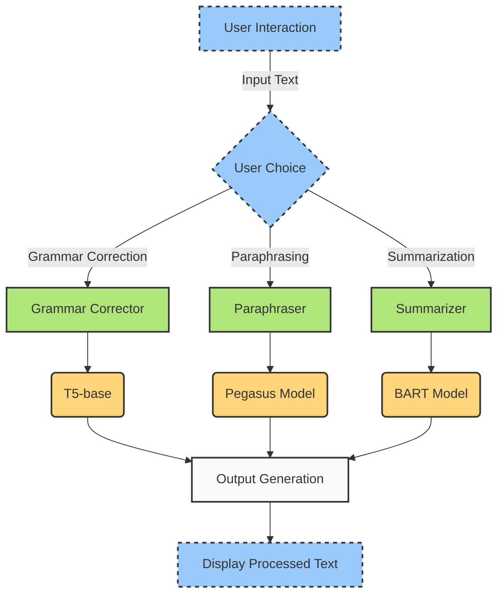

## Text Wizard!!

### Overview

Welcome to the Text Processing Pipeline project! This repository contains the code and resources for a web application that offers advanced text processing capabilities, including grammar correction, paraphrasing, and summarization. The application leverages state-of-the-art language models to provide high-quality text transformations.

### Features

- **Grammar Correction**: Automatically corrects grammatical errors in the text.
- **Paraphrasing**: Rephrases the text while preserving its original meaning.
- **Summarization**: Summarizes the text to a shorter version, retaining the main points.

### Project Structure

The project is organized as follows:

- `app/`: Contains the web application code.
- `models/`: Includes the model implementation and loading scripts.
- `static/`: Stores static files such as images and stylesheets.
- `templates/`: Contains HTML templates for the web application.
- `README.md`: Project documentation and overview.

### Usage

1. **Input Text and Choose an Option**:
   - Enter your text in the provided input box.
   - Select one of the options: Grammar Correction, Paraphrasing, or Summarization.
   - Click the "Submit" button.

2. **View Results**:
   - The processed text will be displayed on the screen.

### Pipeline Diagram

Below is a visualization of the text processing pipeline:

### Detailed Workflow

1. **User Interaction**:
   - Users input their text and select a processing option via the web app.

2. **Routing Based on Choice**:
   - The input text is routed to the selected processing module.

3. **Text Processing**:
   - **Grammar Correction**:
     - Uses the T5-base/vennify-grammar-corrector model.
   - **Paraphrasing**:
     - Uses the Pegasus model.
   - **Summarization**:
     - Uses the BART model.

4. **Output Generation**:
   - The processed text is returned to the web application and displayed to the user.

### Contributing

We welcome contributions to improve this project! Please fork the repository and submit pull requests for any enhancements or bug fixes.

### Contact

For any questions or inquiries, please contact (mailto:kunalnathkaustav01@gmail.com).

---

Thank you for using our Text Processing Pipeline project! We hope it serves your needs well.

Feel free to customize this text according to your project's specific details and requirements.
